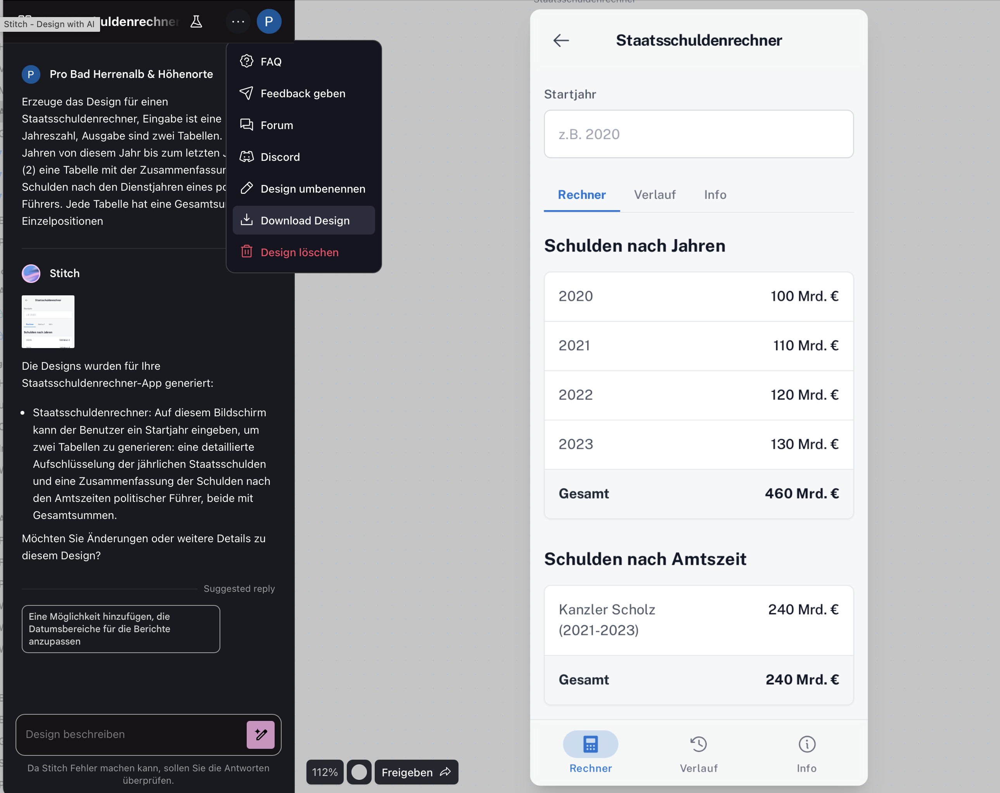
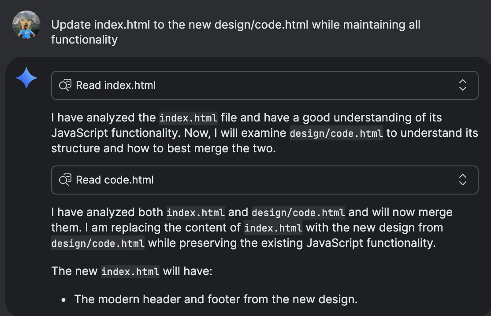

```{r setup, include=FALSE}
knitr::opts_chunk$set(echo = TRUE)
```

---

## Der Paradigmenwechsel in der Softwareentwicklung

### Hauptthese

*Das Erlernen des Programmierens im KI-Zeitalter dient nicht mehr primär dem mechanischen Akt des Codeschreibens, sondern der Entwicklung der fundamentalen Expertise, systematisch zu denken und robuste Systeme zu entwerfen.*


## Der Paradigmenwechsel in der Softwareentwicklung

### Kernpunkte

-   **Vom Produzenten zum Dirigenten:** Entwickler steuern KI-Assistenten, anstatt jede Codezeile manuell zu erstellen.
-   **Fokus auf "Warum" & "Wie":** Die strategische Systemarchitektur rückt in den Vordergrund, während die KI das "Was" der Implementierung übernimmt.
-   **Menschliche Expertise als Kernkompetenz:** Kritisches Denken und die Validierung von KI-Ergebnissen werden entscheidend.

---

## Was ist "Vibe Coding"?

### Definition:

Geprägt von KI-Forscher Andrej Karpathy, beschreibt "Vibe Coding" die Nutzung von KI zur Code-Generierung aus natürlichsprachlichen Anweisungen.

### Zwei Ausprägungen:

1.  **"Reines" Vibe Coding (Riskant):** Blindes Akzeptieren von KI-Code ohne tiefes Verständnis. Geeignet für Prototypen, aber untragbar für kommerzielle Anwendungen.

2.  **Verantwortungsvolle KI-Assistenz (Professionell):** Die KI agiert als "Pair Programmer". Der Mensch leitet an, überprüft, testet, versteht den Code vollständig und übernimmt die alleinige Verantwortung.

## Was ist "Vibe Coding"?



## Was ist "Vibe Coding"?



## Die neue Entwicklerrolle

### Vom Handwerker zum Architekten

| **Traditionelles Programmieren** | **Verantwortungsvolle KI-Assistenz** |
| --- | --- |
| Fokus auf Syntax und Semantik | Fokus auf Absicht und Ergebnis |
| Manuelle, zeilenweise Code-Erstellung (z.T. mit Auto-Complete) | Dialogbasierte Steuerung von KI-Assistenten |
| Entwickler als "Handwerker" | Entwickler als "Architekt" & "Qualitätsmanager" |
| Wissen über spezifische Algorithmen | Systemdenken und Validierungsfähigkeiten |

**Kernbotschaft:** KI ist eine neue Abstraktionsebene. Die kognitive Leistung verschiebt sich vom Erinnern an Syntax zur Formulierung präziser Absichten und kritischer Bewertung der Ergebnisse.


## Transformation des Software Development Lifecycle (SDLC)

### Wie KI jede Phase verändert

| Phase | KI-gestützte Aufgabe (Maschine) | Neue menschliche Kernkompetenz |
| --- | --- | --- |
| **Konzeption** | Generierung von Mockups & Prototypen  | Systemdenken, Anforderungsvalidierung |
| **Implementierung** | Code-Generierung, Autovervollständigung  | Kritisches Code-Review, Qualitätssicherung |
| **Testen** | Autom. Generierung von Testfällen  | Teststrategie-Design, Edge-Case-Analyse |
| **Debugging** | Autom. Fehlerlokalisierung, Lösungsvorschläge  | Systemische Ursachenanalyse |
| **Iteration** | Autom. Dokumentationserstellung  | Strategisches Management von Technical Debt |


## Transformation des Software Development Lifecycle (SDLC)

### Fazit

KI automatisiert mechanische, repetitive Aufgaben in jeder Phase des SDLC. Die menschliche Rolle wird konsequent aufgewertet – hin zu strategischen, analytischen und kreativen Tätigkeiten.

## Phase 1: Konzeption & Design

### Architekt statt Handwerker

**KI als "Junior-Analyst":**

Analysiert User Stories und generiert UI-Mockups und Prototypen in Minuten statt Tagen.

**Neue menschliche Kernkompetenzen:**

*   **Systemdenken:** Das Gesamtbild und komplexe Wechselwirkungen verstehen, die die KI nicht kennt.
*   **Anforderungs-Validierung:** Kritische Fragen stellen und Ambiguitäten interpretieren.
*   **Design-Trade-offs:** Strategische Entscheidungen zwischen Skalierbarkeit, Kosten, Sicherheit und Performance treffen.
*   **Ethik & Empathie:** Ein faires, zugängliches und menschzentriertes Design sicherstellen.


## Phase 2: Implementierung

### Der kritische Qualitätsmanager

**KI als "fleißiger Schreiber":**

*   Generiert Codeblöcke und automatisiert Routineaufgaben, was die Produktivität erheblich steigern kann.
*   **RISIKO:** KI-Code kann Sicherheitslücken, schlechte Praktiken und logische Fehler enthalten.

**Neue menschliche Kernkompetenzen:**

*   **Kritisches Code-Review:** Den generierten Code Zeile für Zeile verstehen, prüfen und validieren. **Man kann nicht validieren, was man nicht versteht**.
*   **Kontextuelle Integration:** Sicherstellen, dass sich der Code nahtlos in die bestehende Architektur einfügt.
*   **Verantwortung:** Der Entwickler, nicht die KI, ist für den Code verantwortlich.

---

## Phase 3: Testen

### Der strategische Risikobewerter

**KI als "unermüdlicher, aber blinder Tester":**

*   Generiert automatisch Tausende von Unit-Tests und deckt Standardszenarien ab.
*   Besitzt jedoch keine Intuition, oft fehlt Domänenwissen und Kreativität.

**Neue menschliche Kernkompetenzen:**

*   **Teststrategie-Entwicklung:** Entscheiden, *was* mit *welcher Intensität* getestet werden muss, basierend auf Geschäftsrisiken.
*   **Exploratives Testen:** Kreatives, ungeskriptetes Suchen nach unerwarteten Fehlern und Designschwächen.
*   **Edge-Case-Analyse:** Gezieltes Untersuchen komplexer Grenzfälle, die eine KI übersieht.

---

## Phase 4: Debugging

### Der System-Detektiv

**KI als "Hilfs-Assistent":**

*   Analysiert Log-Dateien, lokalisiert wahrscheinliche Fehlerquellen und schlägt Lösungen vor.
*   **RISIKO:** KI-Fixes können das Symptom, aber nicht die tiefere, systemische Ursache beheben.

**Neue menschliche Kernkompetenzen:**

*   **Systemische Ursachenanalyse:** Über die einzelne Codezeile hinausblicken und nach architektonischen Grundproblemen suchen.
*   **Hypothesenbildung:** KI-Vorschläge als Spuren nutzen und systematisch im Gesamtsystem überprüfen.
*   **Kontextuelles Debugging:** Domänenwissen einbringen, um zu verstehen, warum technisch korrekter Code im Geschäftskontext falsch ist.

---

## Phase 5: Iteration & Wartung

### Der visionäre Systemverwalter

**KI als "Protokollant & Wachposten":**

*   Automatisiert die Erstellung und Aktualisierung der Dokumentation.
*   Überwacht die Systemleistung und schlägt proaktiv Optimierungen vor.

**Neue menschliche Kernkompetenzen:**

*   **Management von Technical Debt:** Strategisch entscheiden, wann und wie technische Schulden abgebaut werden sollen – eine ökonomische Entscheidung.
*   **Architektonische Weiterentwicklung:** Vorausschauend planen, um sicherzustellen, dass die Architektur zukünftige Anforderungen tragen kann.
*   **Langfristige Vision:** Die Produktentwicklung im Einklang mit der Unternehmensstrategie steuern.

---

## Synthese: Die neuen Grundpfeiler der Ausbildung

### Was Hochschulen jetzt lehren müssen

1.  **Abstraktion & Systemdenken**
    *   *Vom Algorithmus zur Architektur:* Wie man komplexe, interagierende Systeme entwirft, modelliert und baut.

2.  **Kritisches Denken & Validierungskompetenz**
    *   *Vom Schreiben zum Überprüfen:* Wie man KI-generierten Code auf Qualität, Sicherheit und Korrektheit prüft.

3.  **Intelligente Kollaboration & Kommunikation**
    *   *Vom Einzelkämpfer zum KI-Dirigenten:* Wie man präzise mit KI-Systemen kommuniziert und in hybriden Teams arbeitet.

---

## Curriculum-Fokus 1: Abstraktion & Systemdenken

### Vom Algorithmus zur Architektur

**Was wir lehren müssen:**

*   **Software-Architektur-Muster:** Tiefes Verständnis von Microservices, Monolithen, ereignisgesteuerten Systemen etc..
*   **Modellierung komplexer Domänen:** Techniken wie Domain-Driven Design (DDD).
*   **Analyse von Trade-offs:** Systematische Abwägung von Performance, Kosten, Sicherheit und Wartbarkeit.
*   **Denken in Schnittstellen (APIs):** Entwurf von klaren Verträgen zwischen Systemkomponenten.

**Pädagogischer Ansatz:** Projektbasierte Kurse und Fallstudien anstelle von isolierten Programmieraufgaben.

---

## Curriculum-Fokus 2: Kritisches Denken & Validierung

### Vom Schreiben zum Überprüfen

**Was wir lehren müssen:**

*   **Systematische Code-Reviews:** Effiziente Analyse von fremdem (KI-)Code auf Lesbarkeit, Logik und Wartbarkeit.
*   **Secure Coding:** Tiefes Verständnis gängiger Sicherheitslücken (z. B. OWASP Top 10) wird zur Grundvoraussetzung.
*   **Robuste Teststrategien:** Entwurf umfassender Testpläne, die über einfache Unit-Tests hinausgehen.
*   **Ethik der KI:** Sensibilisierung für Bias, algorithmische Diskriminierung und gesellschaftliche Auswirkungen.

**Pädagogischer Ansatz:** "Adversariale" Programmieraufgaben, bei denen Studierende KI-Code auf Schwachstellen untersuchen müssen.

---

## Curriculum-Fokus 3: Intelligente Kollaboration

### Vom Einzelkämpfer zum KI-Dirigenten

**Was wir lehren müssen:**

*   **"Prompt Engineering" als technische Spezifikation:** Formulierung präziser, kontextreicher und unmissverständlicher Anweisungen für die KI.
*   **Mensch-KI-Interaktion (HAX):** Verständnis für die Funktionsweise, Stärken und Schwächen von LLMs, um Automation Bias zu vermeiden.
*   **Kollaborative Werkzeuge:** Effektiver Einsatz von Git und CI/CD-Pipelines zur Nachverfolgung und Validierung von KI-Code.
*   **Technische Kommunikation:** Fähigkeit, komplexe Architekturen und Design-Entscheidungen klar zu vermitteln.

**Pädagogischer Ansatz:** Pair-Programming-Aufgaben, bei denen ein Student die KI "dirigiert" und der andere den Output validiert.

---

## Fazit & Diskussion

### Programmieren relevanter als je zuvor

**Fazit:**

Programmieren zu lernen ist heute wichtiger denn je. Es ist die Schulung in der Fähigkeit, mit komplexen, logischen Systemen zu interagieren, sie zu entwerfen, zu steuern und zu validieren. Es schult das Gehirn in Logik und Abstraktion – genau den Fähigkeiten, die zur Steuerung mächtiger KI-Werkzeuge notwendig sind.

**Diskussionsfragen:**

*   Wie können wir diese neuen Kompetenzen effektiv bewerten?
*   Welche Rolle spielen traditionelle Informatik-Grundlagen (z. B. Komplexitätstheorie)?


